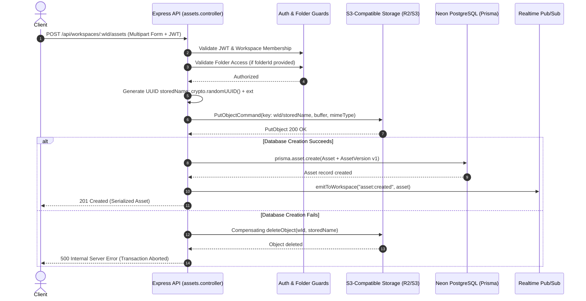
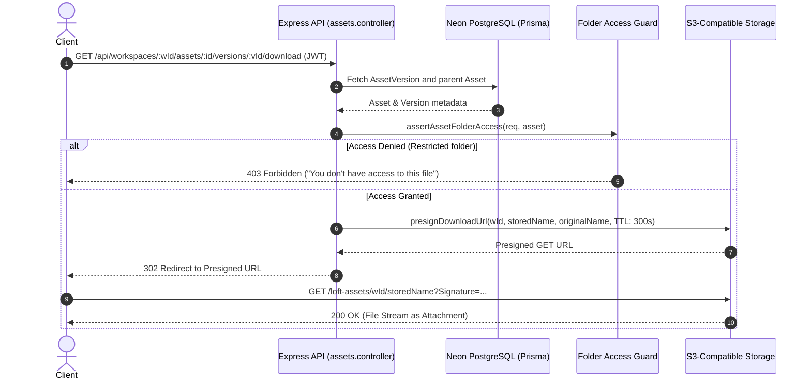
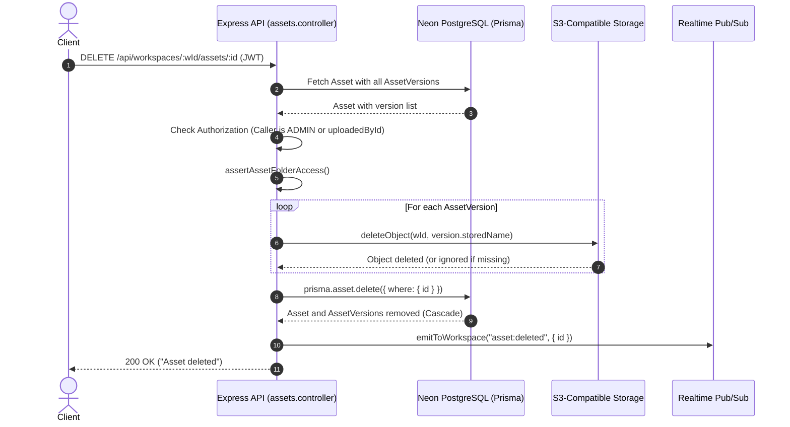

# LOFT Database & Cloud Storage Plan

**Author:** Backend Infrastructure Engineer (Database & Cloud Storage)
**Status:** Audit & Implementation Proposal
**Target Platform:** LOFT Multi-Team Collaboration System
**Tracking Context:** PostgreSQL (Neon) & S3-Compatible Object Storage

---

## 1. Purpose

This document provides a comprehensive technical audit, architectural evaluation, and step-by-step implementation plan for the two backend infrastructure pillars of the LOFT multi-team collaboration system:
1. **Database Infrastructure:** PostgreSQL hosted on Neon, managed through Prisma ORM (`@prisma/client` and `prisma`).
2. **Cloud/Object Storage Infrastructure:** Transitioning file and asset management from an incomplete/unconfigured S3 client to an authenticated, production-grade, S3-compatible cloud storage architecture.

The Neon PostgreSQL connection (`DATABASE_URL` and `DIRECT_URL`) was previously verified, reviewed, approved, and merged into `main` (Merge commit `91c96e6`). This document establishes the technical roadmap for completing schema integrity, seed workflows, backend search query mechanisms, S3-compatible provider integration, and database-storage transactional consistency without altering working infrastructure prematurely.

---

## 2. Current Architecture

LOFT is a multi-team workspace and collaboration platform consisting of four top-level components:
- `client/`: React 18 SPA (Vite, Tailwind CSS, Lucide icons, Tiptap, Socket.io client).
- `server/`: Node.js / Express REST API and Socket.io server with Prisma ORM.
- `realtime/`: Standalone serverless WebSocket engine running on Neon Functions with direct PostgreSQL pooling via `pg.Pool` for pub/sub message synchronization across distributed isolates.
- `docs/`: Technical documentation and milestone roadmap (`docs/ROADMAP.md`).

### Database
- **Provider:** PostgreSQL running on Neon Serverless Postgres.
- **ORM / Client:** Prisma ORM (`5.20.0`) using `@prisma/client`.
- **Connection Architecture:**
  - `DATABASE_URL`: Pooled connection string (utilizing PgBouncer connection pooling on Neon) used by Express runtime services (`server/src/db/prisma.js`) and raw polling in Neon Functions (`realtime/src/index.js`).
  - `DIRECT_URL`: Unpooled direct PostgreSQL connection string configured in `schema.prisma` datasource specifically for schema migration operations (`prisma migrate dev`, `prisma migrate deploy`) that require session-level DDL locks not supported by transaction poolers.
- **Migration State:** 15 sequentially numbered SQL migrations stored in `server/prisma/migrations/`.
- **Data Portability Design:** Prisma schema avoids provider-specific native enums, arrays, or JSON types; all enumerated states are validated at the application layer via Zod and stored as portable `String`, `Int`, `DateTime`, or `Boolean` types.

### File/Object Storage
- **Current State:** Incomplete S3-compatible abstraction transitioning away from legacy local disk assumptions.
- **SDK:** `@aws-sdk/client-s3` (`^3.1127.0`) and `@aws-sdk/s3-request-presigner` (`^3.1127.0`).
- **Storage Abstraction:** Implemented in `server/src/utils/uploads.js`.
- **Runtime Handling:** Uploads pass through an in-memory Multer middleware buffer (`multer.memoryStorage()`) in `server/src/routes/assets.routes.js`, which then forwards buffer streams via `PutObjectCommand` to the configured S3 endpoint.
- **Access Model:** Download routes issue 300-second presigned S3 `GetObjectCommand` URLs with `ResponseContentDisposition` set to attachment, returning an HTTP 302 redirect.
- **Graceful Fallback:** Commit `7ec111c` implemented lazy S3 initialization (`getS3Client()`) and guard checks (`assertStorageConfigured()`). If storage environment variables are missing, the server boots cleanly, and storage routes return HTTP 503 (`"Object storage is not configured"`) instead of crashing the process on startup.

---

## 3. Current Database Models

The Prisma schema (`server/prisma/schema.prisma`) defines 20 distinct data models representing all core domain entities:

1. **`User`**: System identities with local authentication (`passwordHash`), Google OAuth (`googleId`), password reset tokens, temporary 6-digit verification codes (`passwordChangeCode`), avatar color/URL, and timestamps.
2. **`Workspace`**: Tenant boundary for collaboration; contains unique `inviteCode`, workspace owner reference, customizable metadata, and theme color.
3. **`WorkspaceMember`**: Junction table establishing user membership in workspaces with granular roles (`ADMIN`, `MANAGER`, `MEMBER`).
4. **`Event`**: Workspace-scoped calendar events with start/end timestamps and reminder timestamps.
5. **`EventAttendee`**: Junction table tracking event invitations and RSVPs across workspace users.
6. **`Task`**: Workspace-scoped kanban tasks with effort scoring (`estimatedMinutes`), pinning (`isPinned`), snooze state (`isSnoozed`), ordering (`Float`), priority tiering (`TIER_1` to `TIER_4`), and assignee references.
7. **`TaskStatus`**: Customizable kanban columns per workspace with label, color, order, and a terminal completion flag (`isDone`).
8. **`Conversation`**: Chat threads supporting workspace channels (`isDefault`, `isGroup`), private 1:1 direct messages (`workspaceId` null), or ephemeral in-meeting chat channels (`isMeetingChat`, `meetingEndedAt`).
9. **`ConversationParticipant`**: Junction table managing access and unread badge tracking (`lastReadAt`) per conversation.
10. **`Message`**: Chat messages supporting text, markdown `@mentions`, and direct file attachment references (`attachmentAssetId`).
11. **`MessageReaction`**: Chat emoji reactions uniquely keyed by `[messageId, userId, emoji]`.
12. **`Notification`**: Polymorphic system alerts (`TASK_ASSIGNED`, `NEW_MESSAGE`, `DEADLINE_CONFLICT`, etc.) linked directly to users.
13. **`Asset`**: Logical file entry in workspace storage; supports folder organization (`folderId`), task attachments (`taskId`), or chat attachments (`chatMessages`).
14. **`AssetVersion`**: Physical file representations tracking immutable version sequence numbers, stored object keys (`storedName`), file sizes, and MIME types.
15. **`Folder`**: Workspace-scoped virtual hierarchy supporting arbitrary nesting (`parentId`), folder-level access restrictions (`visibility: WORKSPACE | RESTRICTED`), and dedicated chat attachment folders (`chatConversationId`).
16. **`FolderMember`**: Whitelist junction table granting explicit access to `RESTRICTED` folders.
17. **`Document`**: Collaborative rich-text documents storing periodic binary Yjs state vector snapshots (`content Bytes?`) with access gating (`visibility: WORKSPACE | ASSIGNED`).
18. **`DocumentAssignee`**: Whitelist junction table granting explicit access to `ASSIGNED` documents.
19. **`RealtimeEvent`**: Cross-process pub/sub event relay table (`id`, `target`, `event`, `payload`, `createdAt`) used to bridge Express API mutations to distributed Neon Functions WebSocket isolates.
20. **`MeetingParticipant`**: Ephemeral active WebRTC participant roster stored in PostgreSQL to maintain consistent participant counts across multiple serverless isolates.

---

## 4. Database Relationships

### Relational Topology and Foreign Key Integrity
- **Workspace Cascades:** Deleting a `Workspace` cascades down to delete `WorkspaceMember`, `Event`, `Task`, `TaskStatus`, `Conversation`, `Asset`, `Folder`, and `Document` records automatically.
- **Folder Scoping:** `Folder` has a self-referential one-to-many relation (`parent` / `children`) with `onDelete: Cascade`. Deleting a parent folder deletes subfolders. `Asset.folderId` uses `onDelete: SetNull`, ensuring that deleting a folder moves its assets to the workspace root rather than destroying files.
- **Asset Versioning:** `Asset` has a one-to-many relationship with `AssetVersion` (`onDelete: Cascade`). Deleting a logical asset cascades to all version records.
- **Task Attachments:** `Asset.taskId` references `Task.id` with `onDelete: Cascade`. Deleting a task automatically cleans up attached asset records.
- **Chat Attachments:** `Message.attachmentAssetId` references `Asset.id` with `onDelete: SetNull`. Deleting an asset preserves the message text while setting the attachment reference to null.
- **Meeting Chats & Folders:** `Conversation.chatFolder` references `Folder.chatConversationId` with `onDelete: Cascade`. Deleting a conversation removes the associated chat files folder.

### Key Indexes & Unique Constraints
- `WorkspaceMember`: `@@unique([workspaceId, userId])`
- `EventAttendee`: `@@unique([eventId, userId])`
- `ConversationParticipant`: `@@unique([conversationId, userId])`
- `MessageReaction`: `@@unique([messageId, userId, emoji])`
- `FolderMember`: `@@unique([folderId, userId])`
- `DocumentAssignee`: `@@unique([documentId, userId])`
- `MeetingParticipant`: `@@unique([workspaceId, userId])`
- `AssetVersion`: `@@unique([assetId, version])` — guarantees sequential version uniqueness and race protection.
- `Folder.chatConversationId`: Unique constraint preventing duplicate folder generation for chat channels.
- `RealtimeEvent`: `@@index([createdAt])` — optimizes time-based event polling and cleanup pruning.

---

## 5. Current Storage Flow

The lifecycle of files through the application is structured as follows:

```
[Client (React SPA)]
       |
       | 1. Multipart Form Upload (file buffer, optional folderId / taskId)
       v
[Express API Router]
       |
       | 2. Auth Middleware: authenticateToken (verifies JWT -> req.userId)
       | 3. Workspace Middleware: requireWorkspaceMember (validates role -> req.membership)
       | 4. Controller Guard: assertStorageConfigured() (checks env vars, returns 503 if missing)
       | 5. Folder Access Guard: isFolderVisible() / assertAssetFolderAccess() (checks RESTRICTED folder whitelist)
       v
[Upload Handler (uploads.js)]
       |
       | 6. generateStoredName(): Generates crypto.randomUUID() + extension (prevents path traversal)
       | 7. uploadObject(): Issues PutObjectCommand to S3 endpoint (buffer, mimeType, key: {workspaceId}/{storedName})
       v
[Database Metadata (Prisma)]
       |
       | 8. prisma.asset.create(): Persists Asset record + AssetVersion (version 1)
       | 9. emitToWorkspace(): Publishes "asset:created" via RealtimeEvent / Socket.io
       v
[Response to Client: 201 Created (Serialized Asset Metadata)]
```

### Download Flow
1. Client requests `GET /api/workspaces/:workspaceId/assets/:assetId/versions/:versionId/download`.
2. Auth and workspace membership are verified via middleware.
3. Controller verifies asset workspace ownership and validates folder visibility via `assertAssetFolderAccess()`.
4. `presignDownloadUrl()` calls `@aws-sdk/s3-request-presigner` to generate a presigned S3 `GetObject` URL valid for 300 seconds, setting `ResponseContentDisposition` to force clean file attachment downloads.
5. Server sends an `HTTP 302` redirect to the presigned S3 URL; the client downloads the file directly from object storage without consuming server bandwidth.

### Delete Flow
1. Client issues `DELETE /api/workspaces/:workspaceId/assets/:assetId`.
2. Controller verifies user is an `ADMIN` or the original `uploadedById` author.
3. Controller executes `deleteObject()` for every `storedName` recorded across all `AssetVersion` records in S3 (best-effort execution).
4. Controller invokes `prisma.asset.delete()`, cascading deletion across all database `AssetVersion` records.
5. Controller emits `"asset:deleted"` to the workspace socket channel.

---

## 6. Findings

### Critical
1. **Missing Database Seed Script on Disk:** `server/package.json` defines `"prisma:seed": "node prisma/seed.js"`, but `server/prisma/seed.js` does not exist in the repository. Local developers and CI pipelines cannot seed baseline administrative users, test workspaces, or default task statuses.
2. **Object Storage Provider Unconfigured:** No active object storage credentials are configured in local environments or provisioned upstream. File upload/download routes properly return HTTP 503, but production deployments require an active S3-compatible provider.
3. **Potential Orphaned S3 Objects on Insert Failure:** In `assets.controller.js` (`uploadAsset`, `uploadTaskAttachment`, `uploadChatAttachment`, and `uploadVersion`), `uploadObject` executes *before* `prisma.asset.create` / `prisma.assetVersion.create`. If the database transaction fails (e.g., database timeout or constraint violation), the binary file remains permanently orphaned in the S3 bucket.

### Recommended
1. **Compensating Upload Cleanup:** Wrap file creation in a `try...catch` block so that if the Prisma database insert fails after an S3 upload, a compensating `deleteObject()` is immediately dispatched to prevent storage leaks.
2. **Global Search Endpoint Implementation:** Implement the missing Phase 2 Global Search feature as a single read-only endpoint (`GET /api/search?q=`) querying `Task`, `Message`, `Asset`, and `User` using workspace-scoped Prisma filters. No database migration is needed.
3. **Database Indexes for Search and Foreign Keys:** Foreign keys on `Task.assigneeId`, `Task.createdById`, and `Message.conversationId` will benefit from explicit Prisma `@@index` annotations as workspace message volumes expand.
4. **Direct Client Upload Considerations:** For files larger than 10MB, routing entire buffers through Express server RAM (`multer.memoryStorage()`) risks high memory consumption under concurrent load. Future iterations should evaluate presigned S3 `PutObject` URLs.

### Optional
1. **PostgreSQL Full-Text Search (`tsvector` / GIN Indexes):** Can be evaluated in Phase 3 if text volume expands beyond the performance of indexed `contains` matching.
2. **Storage Usage Quota Tracking:** Adding a `storageUsedBytes` accumulator column to `Workspace` could enforce workspace storage tier limits if paid billing is enabled.

---

## 7. Database Roadmap

### DB-1: Neon/Prisma Verification & Seed Baseline — ✅ COMPLETED
- **Objective:** Establish a repeatable database verification baseline and supply the missing `server/prisma/seed.js` script.
- **Current State:** COMPLETED. `server/prisma/seed.js` implemented with deterministic UUID fixtures and verified idempotent.
- **Required Work:** Complete. Script populates test accounts (`alice@loft.test`, `bob@loft.test`, `charlie@loft.test`, `diana@loft.test`), workspaces (Alpha, Beta, Gamma), task statuses, tasks, folders, assets (metadata fixtures), documents, and notifications.
- **Files Involved:** `server/prisma/seed.js`, `server/package.json`.
- **Migration Required:** No.
- **Risks:** None. Script uses idempotent `upsert` queries.
- **Testing Requirements:** Run seed script against a clean database; verify all models populate without unique constraint violations.
- **Completion Criteria:** `npm run prisma:seed` exits with code 0 and logs seeded records.

### DB-2: Schema and Relationship Corrections (Audit Confirmation) — ✅ COMPLETED
- **Objective:** Validate that existing schema models, cascades, and constraints are fully sound.
- **Current State:** COMPLETED. The schema and 15 sequential migrations are 100% consistent and correctly normalized.
- **Required Work:** Validated. No schema corrections required.
- **Files Involved:** `server/prisma/schema.prisma`.
- **Migration Required:** No.
- **Risks:** None.
- **Testing Requirements:** Execute `npx prisma validate`.
- **Completion Criteria:** Schema validation succeeds with zero errors.

### DB-3: Indexing and Query Performance — ⏳ PLANNED
- **Objective:** Add targeted indexes to high-frequency query foreign keys without altering business logic.
- **Current State:** Composite unique constraints provide implicit indexes on junction tables, but individual foreign keys (`Task.assigneeId`, `Message.conversationId`, `Asset.folderId`) rely on sequential scans if unindexed.
- **Required Work:** Evaluate index additions in `schema.prisma` after measuring query volume:
  - `Task`: `@@index([workspaceId, status])`, `@@index([assigneeId])`
  - `Message`: `@@index([conversationId, createdAt])`
  - `Asset`: `@@index([workspaceId, folderId])`
- **Files Involved:** `server/prisma/schema.prisma`, new migration file.
- **Migration Required:** Yes (when implemented).
- **Risks:** Index creation locks tables briefly in standard Postgres (mitigated by Neon's instant compute elasticity).
- **Testing Requirements:** Verify `EXPLAIN ANALYZE` on task listing and message history queries.
- **Completion Criteria:** Migration applies cleanly; query plans show index scans instead of sequential scans.

### DB-4: Global Search Backend Queries — ✅ COMPLETED
- **Objective:** Implement workspace-authorized multi-entity search across tasks, messages, assets, and users.
- **Current State:** COMPLETED. Implemented in `server/src/controllers/search.controller.js` and mounted at `GET /api/search` in `server/src/app.js`.
- **Required Work:** Complete. Queries scoped to caller's authorized workspaces and filtered by folder permissions.
- **Files Involved:** `server/src/controllers/search.controller.js`, `server/src/routes/search.routes.js`, `server/src/app.js`.
- **Migration Required:** No.
- **Risks:** Unindexed `ILIKE` / `contains` scans could experience latency on very large datasets (>100k messages).
- **Testing Requirements:** Integration tests verifying that cross-workspace information never leaks to unauthorized users.
- **Completion Criteria:** `GET /api/search?q=` returns grouped results filtered strictly by the caller's memberships.

### DB-5: Database Testing & Integrity Verification — ✅ COMPLETED
- **Objective:** Implement automated regression tests verifying cascading deletions, authorization, and query integrity.
- **Current State:** COMPLETED. Comprehensive automated test suite in `server/test/search.test.js` (18 passing tests).
- **Required Work:** Complete. Test suite exercises unauthenticated rejection, empty queries, whitespace normalization, case-insensitivity, cross-workspace isolation, folder restriction gating, sensitive field exclusion, and seed idempotency.
- **Files Involved:** `server/test/search.test.js`, `server/package.json`.
- **Migration Required:** No.
- **Risks:** None (runs safely against test fixtures).
- **Testing Requirements:** Execute test suite; verify all assertions pass.
- **Completion Criteria:** Tests run and verify cascade rules and unique constraints cleanly.

### DB-6: Production Readiness & Connection Resilience
- **Objective:** Harden Prisma client pooling, idle connection limits, and graceful shutdown hooks.
- **Current State:** `server/src/db/prisma.js` instantiates standard `PrismaClient` with default connection pools.
- **Required Work:** Add connection retry logic and explicit process termination signals (`SIGINT`, `SIGTERM`) invoking `prisma.$disconnect()`.
- **Files Involved:** `server/src/db/prisma.js`, `server/src/index.js`.
- **Migration Required:** No.
- **Risks:** None.
- **Testing Requirements:** Verify clean server shutdown without lingering Neon connection pool exhaustion.
- **Completion Criteria:** Node process terminates with 0 hanging sockets on SIGTERM.

---

## 8. Global Search Database Plan

The LOFT Roadmap (`docs/ROADMAP.md`) specifies a Global Search feature enabling users to search across tasks, messages, files, and teammates from a single query.

### Architectural Review & Migration Statement
> **No database schema migration is required for the initial Global Search implementation.**

The existing PostgreSQL schema and Prisma models already include all necessary relation fields, foreign keys, and indexes to support multi-entity search with server-side authorization enforcement.

### Query Implementation Design
The search controller will accept query parameter `q` (minimum 2 characters) and execute four parallel queries using `Promise.all()`:

1. **Workspace Authorization Scope:**
   ```javascript
   const memberships = await prisma.workspaceMember.findMany({
     where: { userId: req.userId },
     select: { workspaceId: true },
   });
   const authorizedWorkspaceIds = memberships.map((m) => m.workspaceId);
   ```

2. **Parallel Sub-Queries:**
   - **Tasks:**
     ```javascript
     prisma.task.findMany({
       where: {
         workspaceId: { in: authorizedWorkspaceIds },
         OR: [
           { title: { contains: q, mode: "insensitive" } },
           { description: { contains: q, mode: "insensitive" } },
         ],
       },
       take: 10,
       include: { workspace: { select: { id: true, name: true } } },
     });
     ```
   - **Messages:**
     ```javascript
     prisma.message.findMany({
       where: {
         conversation: {
           OR: [
             { workspaceId: { in: authorizedWorkspaceIds } },
             { participants: { some: { userId: req.userId } } },
           ],
         },
         content: { contains: q, mode: "insensitive" },
       },
       take: 10,
       include: {
         sender: { select: { id: true, name: true, avatarColor: true } },
         conversation: { select: { id: true, title: true, workspaceId: true } },
       },
     });
     ```
   - **Assets (Files):**
     Query assets within `authorizedWorkspaceIds`. For assets located inside folders, verify folder visibility (`isFolderVisible`) using folder membership records to ensure restricted folders do not leak file names in search results.
   - **Users / Members:**
     Find distinct users who share at least one workspace with `req.userId` matching `name` or `email`.

3. **Performance Optimization:** Limit each entity to 10 results (`take: 10`) to ensure fast response times (<50ms).

---

## 9. Cloud Storage Requirements

LOFT requires a reliable, secure, cost-effective object storage system satisfying these criteria:
- **Persistent Object Storage:** Durable storage independent of transient server compute instances or local disk.
- **Private Objects by Default:** Buckets must reject public anonymous reads. All access must be mediated via signed URLs or authenticated proxying.
- **S3 API Compatibility:** Standard S3 protocol compatibility (`PutObject`, `GetObject`, `DeleteObject`, presigned URLs) to prevent vendor lock-in.
- **Strong Isolation:** Objects partitioned by workspace hierarchy (`${workspaceId}/${storedName}`) preventing cross-tenant leakage.
- **Metadata Preservation:** Storage of original file names, MIME types, and file sizes in PostgreSQL metadata.
- **Filename Sanitization:** Uploaded files stored under cryptographic UUID keys (`generateStoredName()`) to eliminate path traversal vulnerabilities.
- **Cost Efficiency for Student/Project Environment:** Predictable costs, generous free tiers, and zero or low egress charges.

---

## 10. Cloud Storage Provider Options

| Provider | S3 API Compatibility | Free Tier / Student Viability | Egress Bandwidth Pricing | Architectural Fit for LOFT |
| :--- | :--- | :--- | :--- | :--- |
| **Cloudflare R2** | High (Path-style & virtual-host S3 compatible) | 10 GB storage free/mo; 10M Class B read ops/mo | **$0.00 / GB (Free Egress)** | **Optimal.** Eliminates egress fees completely for file downloads and media streaming. Seamless S3 SDK compatibility. |
| **Backblaze B2** | High (Dedicated S3-compatible API endpoint) | 10 GB storage free; low API call costs | Free egress up to 3x stored data (Bandwidth Alliance) | **Excellent.** Highly cost-effective; drop-in S3 compatibility via custom endpoint URL. |
| **Neon Object Storage** | High (Early access / experimental S3 gateway) | Integrated with Neon Postgres management | Dependent on Neon underlying cloud partner | **Promising long-term**, but currently less mature than dedicated object storage providers. |
| **AWS S3** | Native standard | 5 GB free for 12 months (standard tier) | ~$0.09 / GB egress after free tier | **Standard Reference.** Works out-of-the-box with current `@aws-sdk/client-s3`, but carries ongoing egress risk if files are downloaded frequently. |
| **Supabase Storage** | S3-compatible gateway over Postgres/Go | 1 GB free storage tier | Limited egress on free tier | Less suitable because LOFT already uses Neon as its primary Postgres database. |

---

## 11. Recommended Storage Architecture

### Recommendation: Cloudflare R2 or Backblaze B2 (S3-Compatible Protocol)
The existing codebase is already built upon `@aws-sdk/client-s3` using custom endpoint configurations (`AWS_ENDPOINT_URL_S3`). Cloudflare R2 is the primary recommendation due to **zero data egress charges**, ensuring that project costs remain exactly \$0 during student development and evaluation.

### Architecture Specifications
1. **Addressing Style:** `forcePathStyle: true` remains configured in `getS3Client()`, which is compatible with Cloudflare R2, MinIO, and Backblaze B2.
2. **Access Control:** All bucket permissions are configured as private (`Block Public Access`).
3. **Download Mechanism:** Presigned S3 URLs (`presignDownloadUrl`) with a 300-second (5 minute) TTL and forced download disposition.
4. **Bucket Isolation:** A single private bucket (`loft-assets`), partitioned by workspace ID prefix (`${workspaceId}/${storedName}`).

---

## 12. Upload Flow



---

## 13. Download Flow



---

## 14. Delete/Cleanup Flow



---

## 15. Database + Storage Consistency

To maintain synchronization between the relational database and cloud object storage without introducing heavy distributed transaction managers, the system adopts deterministic order-of-operations and compensating actions:

### Case A: Object upload succeeds but database Asset creation fails
- **Failure Mode:** Binary uploaded to S3, but database network interruption or schema constraint throws an exception during `prisma.asset.create`. Leaves an unreferenced orphan file in object storage.
- **Handling Strategy:** Wrap the database operation in a `try...catch` block. If database persistence throws an error, immediately issue a compensating `deleteObject(workspaceId, storedName)` before bubbling up the HTTP 500 error.

### Case B: Database Asset creation succeeds but object upload fails
- **Failure Mode:** Database record exists, but binary payload is missing from storage, causing 404 errors on download attempts.
- **Handling Strategy:** Prevented by design. The upload pipeline **never** writes the database record before the storage upload resolves successfully. Storage `PutObjectCommand` must return HTTP 200 before `prisma.asset.create()` is called.

### Case C: Database deletion succeeds but object deletion fails
- **Failure Mode:** Database record is deleted, but S3 network error causes `DeleteObjectCommand` to fail, leaving an orphaned file in the bucket.
- **Handling Strategy:** In `assets.controller.js`, `deleteObject` is called prior to `prisma.asset.delete`. Even if an individual S3 delete operation fails, the failure is caught and logged, allowing the database deletion to proceed. A daily or weekly cleanup job comparing S3 keys against active `AssetVersion.storedName` records can purge unreferenced objects.

### Case D: Object is deleted from storage but its database record remains
- **Failure Mode:** Manual bucket modification or out-of-band deletion leaves dangling database pointers.
- **Handling Strategy:** The download endpoint intercepts 404/NoSuchKey errors from presigned fetch operations and returns a clean, user-facing HTTP 404 (`"File content unavailable"`) rather than an unhandled 500 server crash.

### Case E: Concurrent version uploads to the same asset
- **Failure Mode:** Two users simultaneously upload Version 2 of the same file.
- **Handling Strategy:** The Prisma schema enforces `@@unique([assetId, version])` on `AssetVersion`. If two requests attempt to create the same version number simultaneously, PostgreSQL transaction serialization rejects the second insert with a unique constraint violation (`P2002`). The client is notified to refresh and retry with the latest version index.

### Case F: Revocation of workspace or folder access after URL generation
- **Failure Mode:** A user obtains a download URL and is subsequently removed from the workspace or folder.
- **Handling Strategy:** Presigned URLs use a strict 300-second (5 minute) expiration window (`expiresIn: 300`). Once expired, any subsequent request requires re-authenticating against the Express API, which immediately rejects the request via `isFolderVisible()` or `requireWorkspaceMember()`.

---

## 16. Authorization & Security

1. **Database as Single Source of Truth:**
   Object storage permissions are completely decoupled from storage bucket ACLs. All authorization logic resides in application services (`folderAccess.js` and `requireWorkspaceMember` middleware).
2. **Short-Lived Signed URLs:**
   Direct bucket access is prohibited. All client downloads utilize temporary HMAC-signed URLs generated on demand with a 300-second maximum lifespan.
3. **Sanitized Storage Keys:**
   Original filenames provided by users are stored strictly in PostgreSQL metadata (`AssetVersion.originalName`). The storage key in the S3 bucket is strictly formatted as `${workspaceId}/${crypto.randomUUID()}${ext}`, preventing directory traversal and file overwrite attacks.
4. **File Validation at Boundaries:**
   Upload routes enforce MIME type validation and file size restrictions (configured via Multer limits) to prevent denial-of-service via oversized payloads.
5. **No Credential Exposure:**
   S3 secret keys and database connection strings are never sent to the client or returned in API responses.

---

## 17. Environment Variables

Below are the standardized environment variable names required across the backend infrastructure.

> **CRITICAL SECURITY NOTICE:**
> Only environment variable **names** are listed. Never store, commit, or log actual secrets, credentials, or connection strings.

### Database Environment Variables
- `DATABASE_URL`: Pooled PostgreSQL connection string for runtime queries (Neon PgBouncer).
- `DIRECT_URL`: Unpooled direct PostgreSQL connection string for Prisma DDL migrations.
- `TEST_DATABASE_URL`: Dedicated connection string for running automated backend integration tests. Must point to an isolated test database (e.g. Neon branch) and must not equal `DATABASE_URL`. Integration tests fail closed if unset.
- `ALLOW_DEV_SEED`: Explicit opt-in flag required to run development seed fixtures (`npm run prisma:seed`). Must be explicitly set to `"true"`. Execution is unconditionally blocked when `NODE_ENV=production`.

### Cloud Storage Environment Variables
- `AWS_REGION`: Cloud storage region (e.g., `auto` for Cloudflare R2, `us-east-1` for AWS).
- `AWS_ENDPOINT_URL_S3`: HTTPS endpoint URL for S3-compatible API requests.
- `AWS_ACCESS_KEY_ID`: S3 API access key identifier.
- `AWS_SECRET_ACCESS_KEY`: S3 API secret access key.
- `AWS_S3_BUCKET`: Target bucket name (defaults to `loft-assets` if omitted).

### Core Server Environment Variables
- `PORT`: HTTP port for Express server (default `4000`).
- `CLIENT_URL`: Origin URL of client frontend for CORS policy (e.g., `http://localhost:5173`).
- `JWT_SECRET`: Secret key for signing and validating session authentication tokens.
- `JWT_EXPIRES_IN`: Token validity lifespan (e.g., `7d`).
- `GOOGLE_CLIENT_ID`: Optional Google OAuth client ID.

---

## 18. Testing Strategy

### Database Verification Matrix
- **Database Isolation & Safety Guards:**
  - Mandatory `TEST_DATABASE_URL` check: integration tests fail closed if missing, preventing execution against primary or production databases.
  - Test database equality rejection: fails closed if `TEST_DATABASE_URL === DATABASE_URL`.
  - Development seed opt-in guard: `seed()` fails closed unless `ALLOW_DEV_SEED="true"` and `NODE_ENV !== "production"`.
  - In-memory safety guard unit tests (`server/test/safety-guards.test.js`) verify all guards without database connection overhead.
- **Connection Verification:** Test cold boot and warm query execution via Prisma Client using pooled `DATABASE_URL`.
- **Migration Idempotency:** Execute `npx prisma migrate status` to confirm all 15 migrations match schema state.
- **Relational Integrity:**
  - Verify workspace deletion cleanly cascades to all owned entities.
  - Verify folder deletion cascades to subfolders and sets `folderId = null` on affected assets.
  - Verify task deletion cascades to task-attached assets and asset versions.
- **Workspace Isolation:** Verify that queries scoped by `workspaceId` never return records belonging to other tenants.
- **Global Search Testing:**
  - Search tasks, messages, and assets with query terms; verify results match `mode: "insensitive"`.
  - Confirm that users only receive search hits from workspaces where they hold active membership.

### Cloud Storage Verification Matrix
- **Upload Functionality:** Upload small text files, PDF documents, and image files; verify binary integrity and S3 key structure.
- **Download Redirection:** Verify that download requests return HTTP 302 redirecting to valid signed S3 URLs.
- **Deletion Cleanup:** Delete an asset and verify that `DeleteObjectCommand` is issued for each version key.
- **Graceful Failure (Missing Credentials):** Start server with unset storage credentials; verify server starts and upload routes return HTTP 503.
- **Folder Restriction Enforcement:** Attempt file download from a `RESTRICTED` folder as a non-member; verify HTTP 403 response.
- **Compensating Rollback:** Simulate a database failure during asset creation; verify that uploaded S3 object is purged.
- **Concurrent Upload Handling:** Execute simultaneous version uploads; verify that PostgreSQL rejects duplicate version numbers via `P2002`.

---

## 19. Development Workflow

All infrastructure modifications must follow the established multi-step branch-and-review lifecycle:

```
main (Production Baseline)
  │
  ├──> Create Topic Branch (e.g., feature/database-seed-and-search)
  │      │
  │      ├──> Local Code Changes & Scratch Verification
  │      ├──> Neon Branch / Database Verification
  │      ├──> Automated & Manual Test Execution
  │      └──> Git Commit (Conventional Commit Format)
  │
  ├──> Push to Remote Repository
  │
  ├──> Open Pull Request against main
  │      │
  │      ├──> CI / Automated Quality Checks
  │      ├──> Teammate Code Review & Approval
  │      └──> Squash or Rebase Merge into main
  │
  v
Pull Updated main Locally
```

---

## 20. Suggested Git Branches

To maintain clean reviews and isolated changes, database enhancements and cloud storage implementations must be developed on separate branches:

### Database Track
- **Branch Name:** `feature/database-seed-and-search`
- **Scope:** Adding `server/prisma/seed.js`, implementing `GET /api/search` backend controller/route, and verifying relational query performance.
- **Suggested Commit Message:**
  ```text
  feat(db): implement baseline seed script and global search queries
  ```

### Storage Track
- **Branch Name:** `feature/cloud-storage-provider`
- **Scope:** Provider configuration validation, upload error compensation in `assets.controller.js`, and comprehensive storage integration verification.
- **Suggested Commit Message:**
  ```text
  feat(storage): configure S3-compatible provider and upload compensation
  ```

---

## 21. Implementation Order

The recommended sequence prioritizes stability, foundational data availability, and zero-downtime execution:

1. **Step 1: Baseline Seed Script (`DB-1`)**
   - Create `server/prisma/seed.js`.
   - Verify local developers can seed test accounts and kanban statuses instantly.
2. **Step 2: Global Search Backend (`DB-4`)**
   - Implement `search.controller.js` and `search.routes.js`.
   - Mount route at `/api/search` in `server/src/app.js`.
   - Verify workspace isolation across all search result sets.
3. **Step 3: Storage Provider Configuration & Compensation (`STORAGE-1`, `STORAGE-3`)**
   - Verify provider endpoint compatibility (Cloudflare R2 / AWS S3).
   - Add compensating S3 cleanup on Prisma insert failures in `assets.controller.js`.
4. **Step 4: End-to-End Verification (`DB-5`, `STORAGE-7`)**
   - Execute full test matrix covering file lifecycle and multi-tenant access control.
5. **Step 5: Documentation & Pull Request Review**
   - Submit separate pull requests for the database and storage tracks.

---

## 22. Definition of Done

### Database Infrastructure Done Criteria
- [x] `server/prisma/seed.js` exists, executes cleanly via `npm run prisma:seed`, and populates essential baseline records without errors.
- [x] `npx prisma validate` passes with zero schema errors or warnings.
- [x] All 15 migrations remain intact and match the live Neon database schema.
- [x] `GET /api/search?q=` returns authorized, workspace-scoped results across Tasks, Messages, Assets, and Users.
- [x] Automated or script-verified tests confirm workspace isolation and cascade deletions.

### Cloud Storage Infrastructure Done Criteria
- [ ] Server starts cleanly both with and without object storage credentials configured.
- [ ] With credentials configured, file uploads succeed, generating valid S3 objects and corresponding `Asset`/`AssetVersion` records.
- [ ] Download requests return 302 redirects to valid presigned S3 URLs that expire after 300 seconds.
- [ ] Deleting an asset removes all version objects from cloud storage and removes database records.
- [ ] Access to restricted folder files is denied (HTTP 403) to unauthorized workspace members.
- [ ] S3 upload failure or database insert failure triggers compensating cleanup with zero orphaned storage objects.

---

## 23. Deferred Work

The following items are deliberately deferred to future roadmap milestones and must **not** be implemented during the current infrastructure phase:
- **Full-Text Search Engines:** Elasticsearch, Algolia, Meilisearch, or PostgreSQL `tsvector` GIN indexing are deferred until message or task volume exceeds simple `contains` query capabilities.
- **Direct Browser-to-S3 Uploads (Presigned POST):** Presigned client-side direct uploads are deferred; the current in-memory Multer pipeline satisfies current file size requirements (<25MB) without added client complexity.
- **Automated Video Transcoding or Image Thumbnail Generation:** Deferred to Phase 3 media processing pipelines.
- **Platform-Wide Admin Panel DB Schema:** Additional platform admin models (`User.isPlatformAdmin`) remain deferred until Phase 2 Milestone 6.
- **Subscription & Billing Data Models:** Adding `Subscription` tables remains deferred until payment gateway provider selection is finalized.
